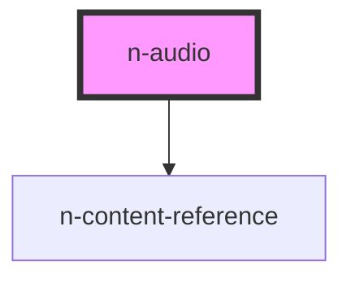

# N-AUDIO

This component is responsible for playing audio requested via the [action](/actions) bus. Internally it holds two players, one for music and another for sounds.

The audio-tracks are declaratively defined in HTML to respond to user interactions. Unlike a typical playlist, the audio items are configured with behavior rules that help orchestrate overlapping sound and music sound.

While it can be placed anywhere, only ONE player is allowed within an HTML document. Loading a second element will have no effect.

Once in-place, the [\<n-audio\>](/components/n-audio) listens on the **audio** topic for commands.

> Note: This component subscribes to route-change notifications - as some audio clips are meant to end when the route changes.

## Audio Actions

To operate the player, it is easiest to just use the `<n-audio-load-*>` components to pre-load the audio. Then declare the actions using the [\<n-action-activator\>](/components/n-action-activator) component.

```html
<n-view-prompt>
  <n-audio-action-sound-load track-id='<unique-id>' src='<url>'>
  </n-audio-action-sound-load>
  <n-action-activator ...>
    <n-audio-action-sound
      command='<command>'
      track-id='<id>'
      value='<value>'
    ></n-audio-action-sound>
  </n-action-activator>
</n-view-prompt>
```

## Display

This player can be configured to display or remain hidden. When displayed, it shows a single icon when a file is loaded and a different icon when it is playing. Clicking it should toggle pause for both of the players simultaneously.


```html
<n-audio display> </n-audio>
```

### Looping

Only the music player will support looping. Default is true. Looping audio loops until its discard event occurs.

If audio is set to loop with no deactivation, any new configuration will end it. For instance, if new audio is configured to activate in a queued fashion, the looping audio should stop and allowing the queued audio to play when it ends.

### Discard Strategy

Each audio track-request defines when it should be stopped and removed from the queue. This allows for music to plays between routes. By default, a route-change will empty the queue of any unplayed audio.

- **route**: When the route changes (default for unmarked)
- **next**: Play/queue until route or another audio is queued.
- **none**: Play until a new track is played (default for music)

### Volume Easing

Hard discards or play ease out the audio with a .5 second fade-out before playing the next clip.

<!-- Auto Generated Below -->


## Usage

### Basic

## Display

This player can be configured to display or remain hidden. When displayed, it shows a single icon when a file is loaded and a different icon when it is playing. Clicking it should toggle pause for both of the players simultaneously.


```html
<n-audio display> </n-audio>
```


## Properties

| Property        | Attribute        | Description                                                                                              | Type                               | Default     |
| --------------- | ---------------- | -------------------------------------------------------------------------------------------------------- | ---------------------------------- | ----------- |
| `actions`       | --               | A reference to the action listener for testing.                                                          | `AudioActionListener \| undefined` | `undefined` |
| `dataProvider`  | `data-provider`  | Experimental support for providing audio-data in the data-provider system.                               | `boolean`                          | `false`     |
| `debug`         | `debug`          | Use debug for verbose logging. Useful for figuring thing out.                                            | `boolean`                          | `false`     |
| `display`       | `display`        | The display mode enabled shows player state and stats. No track information or duration is be displayed. | `boolean`                          | `false`     |
| `howlerVersion` | `howler-version` | The Howler.js Script Reference                                                                           | `string`                           | `'2.2.1'`   |


## Dependencies

### Depends on

- [n-content-reference](../n-content-reference)

### Graph


----------------------------------------------

NENT 2021 - all rights reserved
