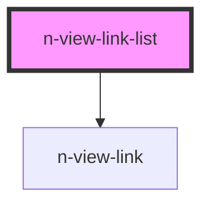

# N-VIEW-LINK-LIST

This component automatically lists out known routes using the current-route as the main context.


This makes it easy to list child-routes programmatically, versus hard-coded links for a variety of uses.


<!-- Auto Generated Below -->


## Overview

Display a list of routes related to the current route.
Modes:
**siblings**: all routes at the same depth level (nav)
**parents**: all parent routes. (breadcrumbs)
**children**: all child routes within a hierarchy. (sub-menu)

## Usage

### Breadcrumbs

A breadcrumb menu that displays the current route and it parent routes.

```html
<nav aria-label="breadcrumb"
  class="bread-nav container text-end">
  <n-view-link-list class="" mode="parents"
    list-class="breadcrumb justify-content-start"
    active-class="active"
    item-class="breadcrumb-item"
    exclude-root>
  </n-view-link-list>
</nav>
```


### Menu

A menu that displays the current routes sibling routes.

```html

<n-view-link-list mode="siblings">
</n-view-link-list>
```


### Submenu

A menu that displays the current route's child routes.

```html
<n-view-link-list mode="children">
</n-view-link-list>
```


## Properties

| Property      | Attribute      | Description                                             | Type                                    | Default     |
| ------------- | -------------- | ------------------------------------------------------- | --------------------------------------- | ----------- |
| `activeClass` | `active-class` | The active-class to use with the n-view-link elements.  | `string`, `undefined`                   | `'active'`  |
| `excludeRoot` | `exclude-root` | Specify if the '/' route should be skipped in the list. | `boolean`                               | `false`     |
| `itemClass`   | `item-class`   | The list-item-class to use with the li tag              | `string`, `undefined`                   | `''`        |
| `linkClass`   | `link-class`   | The class to add to the anchor tag.                     | `string`, `undefined`                   | `''`        |
| `listClass`   | `list-class`   | The list-class to use with the UL tag                   | `string`, `undefined`                   | `''`        |
| `mode`        | `mode`         | The display mode for which routes to display.           | `"children"`, `"parents"`, `"siblings"` | `'parents'` |


## Dependencies

### Depends on

- [n-view-link](../n-view-link)

### Graph


----------------------------------------------

NENT v0.10.8 - Copyright 2022 [all rights reserved]
