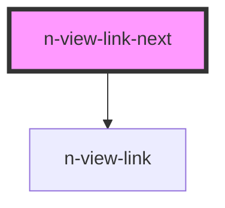

# N-VIEW-LINK-NEXT

This component automatically links to the next route, as defined in the HTML. It first goes to the next sibling route. If none, then it links to the parent route.

<!-- Auto Generated Below -->


## Usage

### Auto

The link will automatically contain the page title as text, if none is specified and the route as a title.

```html
<n-view-link-next>
</n-view-link-next>
```


### Wrapped

The link will wrap whatever HTML you include between the tags.

```html
<n-view-link-next>
    <icon/> Next
</n-view-link-next>
```


## Properties

| Property    | Attribute    | Description                         | Type                  | Default     |
| ----------- | ------------ | ----------------------------------- | --------------------- | ----------- |
| `linkClass` | `link-class` | The class to add to the anchor tag. | `string`, `undefined` | `undefined` |
| `text`      | `text`       | The link text                       | `string`, `undefined` | `undefined` |


## Dependencies

### Depends on

- [n-view-link](../n-view-link)

### Graph


----------------------------------------------

NENT v0.10.8 - Copyright 2022 [all rights reserved]
