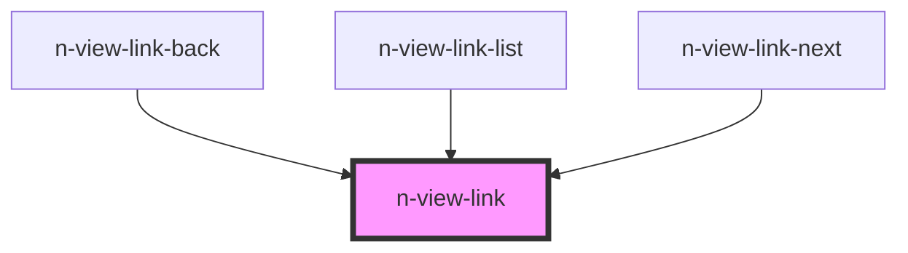

# N-VIEW-LINK

The element should be used in place of an `a` tag to navigate without refreshing the page. This element supports an active-class that will be applied when the route in `href` matches the route of the app. This is helpful for menus, bread-crumbs, and tabs.


<!-- Auto Generated Below -->


## Overview

The element should be used in-place of an `a` tag to navigate without
refreshing the page. This element supports an active-class that will
be applied when the route in **href** matches the route of the app.

This is helpful for displaying active routes in menus, bread-crumbs and tabs.

## Usage

### Menu

When used in a menu or navigation system, you can leverage the active-class that is added when the href-route is active.

```html
<n-view-link path='/route' active-class='my-active-class'> ... </n-view-link>
```


### View

To create a link to a route, simply use the route in the `href` attribute.

```html
<n-view-link path='/route'> ... </n-view-link>
```


## Properties

| Property            | Attribute      | Description                                                                                          | Type                  | Default     |
| ------------------- | -------------- | ---------------------------------------------------------------------------------------------------- | --------------------- | ----------- |
| `activeClass`       | `active-class` | The class to add when the matching route is active in the browser                                    | `string`              | `'active'`  |
| `debug`             | `debug`        | Provide log messages for path matching.                                                              | `boolean`             | `false`     |
| `exact`             | `exact`        | Only active on the exact href match, and not on child routes                                         | `boolean`             | `false`     |
| `linkClass`         | `link-class`   | The class to add to the anchor tag.                                                                  | `string`, `undefined` | `undefined` |
| `path` _(required)_ | `path`         | The destination route for this link                                                                  | `string`              | `undefined` |
| `strict`            | `strict`       | Only active on the exact href match using every aspect of the URL including parameters.              | `boolean`             | `true`      |
| `validate`          | `validate`     | Validates any current-route inputs before navigating. Disables navigation if any inputs are invalid. | `boolean`             | `false`     |


## Dependencies

### Used by

 - [n-view-link-back](../n-view-link-back)
 - [n-view-link-list](../n-view-link-list)
 - [n-view-link-next](../n-view-link-next)

### Graph


----------------------------------------------

NENT v0.10.8 - Copyright 2022 [all rights reserved]
