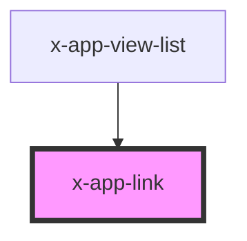

# X-APP-LINK

The element should be used in-place of an `a` tag to navigate without refreshing the page. This element supports an active-class that will be applied when the route in **href** matches the route of the app. This is helpful for menus, bread-crumbs and tabs.


<!-- Auto Generated Below -->


## Usage

### Menu

When used in a menu or navigation system, you can leverage the active-class that is added when the href-route is active.

```html
<x-app-link href='/route' active-class='my-active-class'> ... </x-app-link>
```


### Route

To create a link to a route, simply use the route in the href attribute.

```html
<x-app-link href='/route'> ... </x-app-link>
```


## Properties

| Property            | Attribute      | Description                                                                             | Type      | Default         |
| ------------------- | -------------- | --------------------------------------------------------------------------------------- | --------- | --------------- |
| `activeClass`       | `active-class` | The class to add when this HREF is active in the browser                                | `string`  | `'link-active'` |
| `debug`             | `debug`        | Provide log messages for path matching.                                                 | `boolean` | `false`         |
| `exact`             | `exact`        | Only active on the exact href match, and not on child routes                            | `boolean` | `false`         |
| `href` _(required)_ | `href`         | The destination route for this link                                                     | `string`  | `undefined`     |
| `strict`            | `strict`       | Only active on the exact href match using every aspect of the URL including parameters. | `boolean` | `true`          |


## Dependencies

### Used by

 - [x-app-view-list](../x-app-view-list)

### Graph


----------------------------------------------

nent 2021 - all rights reserved
