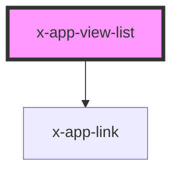

# x-app-view-list

<!-- Auto Generated Below -->

## Properties

| Property      | Attribute      | Description                                             | Type                                    | Default     |
| ------------- | -------------- | ------------------------------------------------------- | --------------------------------------- | ----------- |
| `activeClass` | `active-class` | The active-class to use with the x-app-link components. | `string`, `undefined`                   | `undefined` |
| `excludeRoot` | `exclude-root` | Specify if the '/' route should be skipped in the list. | `boolean`                               | `false`     |
| `itemClass`   | `item-class`   | The list-item-class to use with the li tag              | `string`, `undefined`                   | `undefined` |
| `listClass`   | `list-class`   | The list-class to use with the UL tag                   | `string`, `undefined`                   | `undefined` |
| `mode`        | `mode`         | The display mode for which routes to display.           | `'children'`, `'parents'`, `'siblings'` | `'parents'` |
| `router`      | --             | The router-service instance  (internal)                 | `RouterService`, `undefined`            | `undefined` |
| `separator`   | `separator`    | The string separator to put between the items.          | `string`, `undefined`                   | `undefined` |

## Dependencies

### Depends on

- [x-app-link](../x-app-link)

### Graph

----------------------------------------------

nent 2021 - all rights reserved
