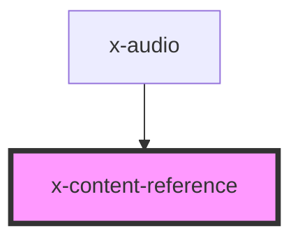

# X-CONTENT-REFERENCE

This component makes a single reference to script and css sources. It can be used by HTML fragment to ensure a reference is made, without worry that it will create duplicate references.

If inline is present, the source would be nested inside this element, otherwise it is appended to the head.

## Usage

```html
<x-content-reference
  script-src='<url>'
  style-src='<url>'>
</x-content-reference>
```

## Examples

### Ensure Style Reference

```html
<html>
  <head></head>
  <body>
    <x-content-reference style-src='assets/styles.css' />
  </body>
</html>
```

**Results**:

```html
<html>
  <head>
    <link rel='stylesheet' href='assets/styles.css' />
  </head>
  <body>
    <x-content-reference style-src='assets/styles.css' />
  </body>
</html>
```

### Ensure Inline Reference

```html
<html>
  <head></head>
  <body>
    <x-content-reference style-src='assets/styles.css' inline />
  </body>
</html>
```

**Results**:

```html
<html>
  <head></head>
  <body>
    <x-content-reference style-src='assets/styles.css'>
      <link rel='stylesheet' href='assets/styles.css' />
    </x-content-reference>
  </body>
</html>
```

### Ensure Script References

```html
<html>
  <head></head>
  <body>
    <x-app-view url='/home'>
      <x-content-reference script-src='lib/script.js' />
    </x-app-view>
    <x-app-view url='/page-1'>
      <x-content-reference script-src='lib/script.js' />
    </x-app-view>
  </body>
</html>
```

**Results**:

```html
<html>
  <head>
    <script src='lib/script.js'></script>
  </head>
  <body>
    <x-app-view url='/home'>
      <x-content-reference script-src='lib/script.js' />
    </x-app-view>
    <x-app-view url='/page-1'>
      <x-content-reference script-src='lib/script.js' />
    </x-app-view>
  </body>
</html>
```

<!-- Auto Generated Below -->


## Usage

### Basic


## Properties

| Property    | Attribute    | Description                                                                                                  | Type                  | Default     |
| ----------- | ------------ | ------------------------------------------------------------------------------------------------------------ | --------------------- | ----------- |
| `deferLoad` | `defer-load` | If set, disables auto-rendering of this instance. To fetch the contents change to false or remove attribute. | `boolean`             | `false`     |
| `inline`    | `inline`     | When inline the link/script tags are rendered in-place rather than added to the head.                        | `boolean`             | `false`     |
| `module`    | `module`     | Import the script file as a module.                                                                          | `boolean`             | `false`     |
| `noModule`  | `no-module`  | Declare the script only for use when modules aren't supported                                                | `boolean`             | `false`     |
| `scriptSrc` | `script-src` | The script file to reference.                                                                                | `string`, `undefined` | `undefined` |
| `styleSrc`  | `style-src`  | The css file to reference                                                                                    | `string`, `undefined` | `undefined` |
| `timeout`   | `timeout`    | Timeout (in milliseconds) to wait for the references to load.                                                | `number`              | `1000`      |


## Events

| Event        | Description                                                                                                                                                                      | Type                                                     |
| ------------ | -------------------------------------------------------------------------------------------------------------------------------------------------------------------------------- | -------------------------------------------------------- |
| `referenced` | This event is fired when the script and style elements are loaded or timed out. The value for each style and script will be true or false, for loaded or timedout, respectively. | `CustomEvent<{ type: ReferenceType; loaded: boolean; }>` |


## Methods

### `forceLoad() => Promise<void>`

Force the 'load' event of the script or link element.
This is meant for testing.

#### Returns

Type: `Promise<void>`


## Dependencies

### Used by

 - [x-audio](../x-audio)

### Graph


----------------------------------------------

nent 2021 - all rights reserved
